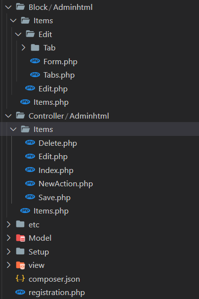

## FileRabit

A simple node module to search a directory and return all the file names relative to the folder specifed
Desined with rapid templating for magento in mind

## This



### Results in

```
[ 'Block/Adminhtml/Items/Edit/Form.php',
  'Block/Adminhtml/Items/Edit/Tab/Main.php',
  'Block/Adminhtml/Items/Edit/Tabs.php',
  'Block/Adminhtml/Items/Edit.php',
  'Block/Adminhtml/Items.php',
  'Controller/Adminhtml/Items/Delete.php',
  'Controller/Adminhtml/Items/Edit.php',
  'Controller/Adminhtml/Items/Index.php',
  'Controller/Adminhtml/Items/NewAction.php',
  'Controller/Adminhtml/Items/Save.php',
  'Controller/Adminhtml/Items.php',
  'Model/Cron.php',
  'Model/Items.php',
  'Model/Resource/Items/Collection.php',
  'Model/Resource/Items.php',
  'Setup/InstallSchema.php',
  'composer.json',
  'etc/adminhtml/menu.xml',
  'etc/adminhtml/routes.xml',
  'etc/crontab.xml',
  'etc/module.xml',
  'registration.php',
  'view/adminhtml/layout/a_co_name_z_a_ext_name_z_items_edit.xml',
  'view/adminhtml/layout/a_co_name_z_a_ext_name_z_items_index.xml' ]

```
---

## To use just do  

```npm install --save https://github.com/IasonArgyrakis/fileRabit.git ```

``` js
let file_list=fileRabit.exploreNest(__dirname + "/Templates/Plugin/MG_CLI/plug-in-name/"); 
```


---

### Thanx

I would like to thank D.Vakerlis for the chance and the work-ethic he instilled in me

